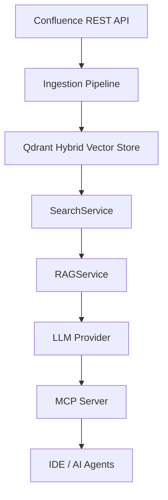
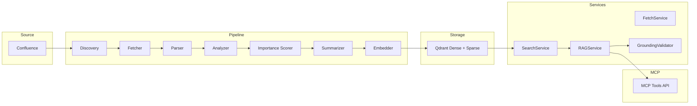
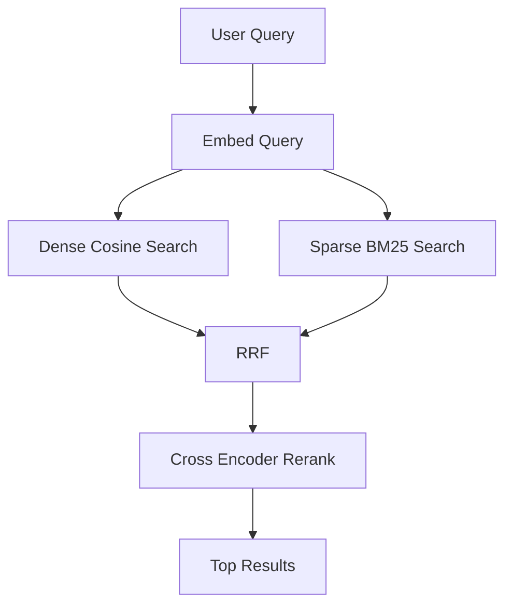
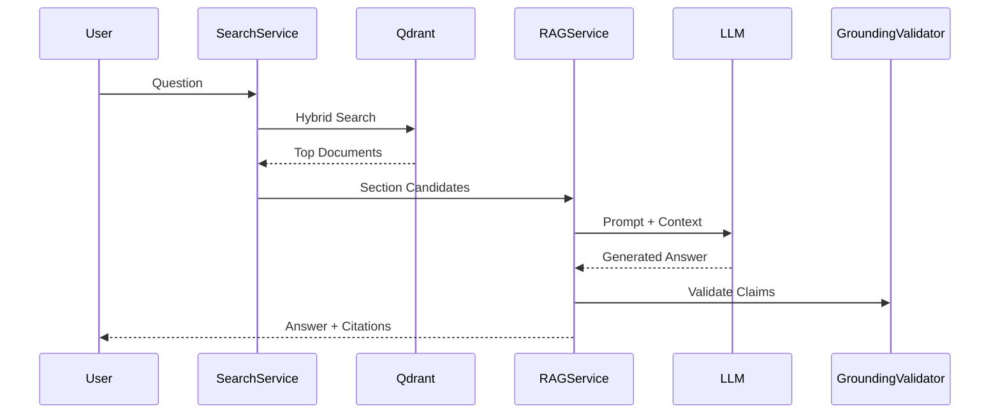

# Confluence MCP Server  
## Hybrid Retrieval + RAG + MCP Integration for Enterprise Knowledge Intelligence

---

## Overview

Confluence MCP Server is an enterprise-grade documentation intelligence system designed to:

- Crawl and index Confluence content
- Perform hybrid dense + sparse retrieval
- Provide grounded Retrieval-Augmented Generation (RAG)
- Integrate seamlessly with AI agents via MCP
- Minimize hallucination while maximizing retrieval precision
- Operate locally (offline embeddings) or with cloud LLM providers

It is modular, scalable, and designed for production-readiness.

---

# Architecture Overview



---

# Layered Architecture



---

# Project Structure

```
CONFLUENCE_MCP/
├── mcp_server/
│   ├── config.py
│   ├── server.py
│   ├── tools/
│   ├── services/
│   ├── pipeline/
│   ├── llm/
│   └── schemas/
├── demo/
├── tests/
├── docs/
├── docker-compose.yml
└── requirements.txt
```

---

# Hybrid Retrieval System

## Why Hybrid?

Dense embeddings capture semantic similarity.  
Sparse embeddings capture keyword precision.  

Combining both improves relevance, recall, and ranking stability.

---

## Hybrid Query Flow



---

## Ranking Algorithm

**Reciprocal Rank Fusion**

```
Score = Σ (1 / (k + rank_i))
```

Followed by cross-encoder reranking for final precision.

---

# Ingestion Pipeline

CLI:

```
python -m mcp_server.pipeline.run_pipeline --full --space WIKI
```

Pipeline Stages:

1. Discovery (CQL search)
2. Fetch content (REST API)
3. Parse HTML → Markdown
4. Analyze metadata
5. Importance scoring (0–3 heuristic)
6. Extractive summary generation
7. Dense + Sparse embedding
8. Qdrant upsert

---

# RAG System Architecture



---

# RAG Modes

| Mode       | Description |
|------------|------------|
| extractive | Source-only response (no LLM generation) |
| ai         | LLM answer without strict extraction |
| hybrid     | Retrieval + LLM synthesis (recommended) |

---

# Hallucination Control

1. Retrieval-constrained prompting  
2. Grounding validation (keyword + optional LLM verification)

---

# Configuration

All configuration is environment-driven.

Example `.env`:

```
CONFLUENCE_BASE_URL=https://your-domain.atlassian.net
CONFLUENCE_API_TOKEN=your_token
QDRANT_HOST=localhost
QDRANT_PORT=6333
LLM_PROVIDER=lm_studio
LLM_BASE_URL=http://localhost:1234/v1
EMBEDDING_MODEL_DENSE=BAAI/bge-base-en-v1.5
EMBEDDING_MODEL_SPARSE=prithivida/Splade_PP_en_v1
```

---

# Running the System

## Start Qdrant

```
docker compose up -d qdrant
```

## Start MCP Server (SSE)

```
python -m mcp_server.server --transport sse --port 8080
```

## Start MCP Server (STDIO)

```
python -m mcp_server.server --transport stdio
```

---

# IDE Integration

## Cursor

```json
{
  "mcpServers": {
    "confluence": {
      "url": "http://localhost:8080/sse"
    }
  }
}
```

---

## VS Code

```json
{
  "servers": {
    "confluence-mcp": {
      "type": "sse",
      "url": "http://localhost:8080/sse"
    }
  }
}
```

---

## Claude Desktop (STDIO)

```json
{
  "mcpServers": {
    "confluence": {
      "command": "/path/to/.venv/bin/python",
      "args": ["-m", "mcp_server.server", "--transport", "stdio"],
      "cwd": "/path/to/project"
    }
  }
}
```

---

# System Design (Interview-Level)

## Design Goals

- High retrieval precision
- Minimal hallucination
- Fresh content over stale embeddings
- Modular abstraction layers
- Scalable architecture

---

## Core Tradeoffs

### Whole-Page Embeddings

**Pros**
- Simple indexing
- Lower storage cost

**Cons**
- Reduced fine-grained recall

Future upgrade: Chunk-level indexing.

---

### Hybrid Search

**Pros**
- High recall + precision

**Cons**
- Increased compute cost

---

### Progressive Summarization

**Pros**
- Immediate searchability
- Quality improves over time

**Cons**
- Requires background worker

---

# Scalability Strategy

## Horizontal

- Qdrant clustering
- Per-space collections
- Worker sharding

## Vertical

- Async embedding
- Distributed reranking
- Cache tier scaling

---

# Failure Handling

| Risk | Mitigation |
|------|------------|
| Confluence rate limits | Async semaphore |
| LLM outages | Provider fallback |
| Stale content | Version-aware cache |
| Hallucination | Grounding validator |

---

# Production Hardening Recommendations

- Reverse proxy + authentication
- Observability (metrics + tracing)
- Retry/backoff for 429/503
- Role-based access filtering
- Chunk-based retrieval
- Async embedding pipeline
- Multi-tenant isolation

---

# Strengths

- Hybrid dense + sparse retrieval
- Cross-encoder reranking
- Progressive LLM enhancement
- Grounding validation
- Offline embeddings support
- MCP-native integration
- Provider abstraction (LM Studio / OpenAI / Azure)

---

# Limitations

- No chunk-level indexing
- Extractive summary is heuristic-based
- Large sparse embedding model (~500MB)
- SSE endpoint lacks authentication
- Embedding generation is synchronous
- No diff-based incremental embedding

---

# Roadmap

- Chunk-level retrieval
- CLIP-based image understanding
- Async embedding workers
- Multi-query expansion
- Streaming RAG responses
- Enterprise authentication layer

---

# Design Philosophy

This system balances:

- Retrieval relevance
- Freshness of content
- Grounded AI responses
- Modularity and extensibility
- Offline-first embedding capability
- Agent-native integration

It is designed as a knowledge intelligence layer for enterprise AI systems.

---
