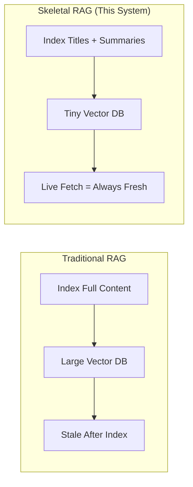
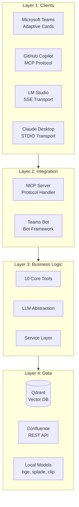
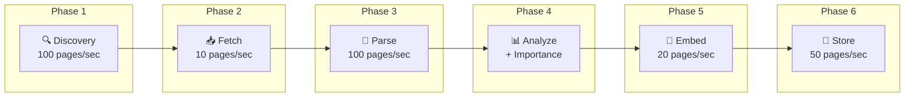
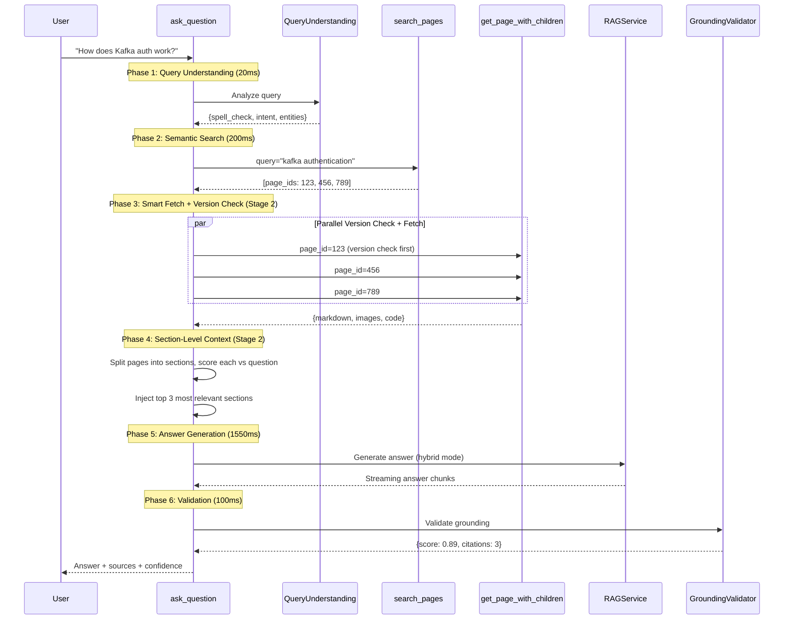
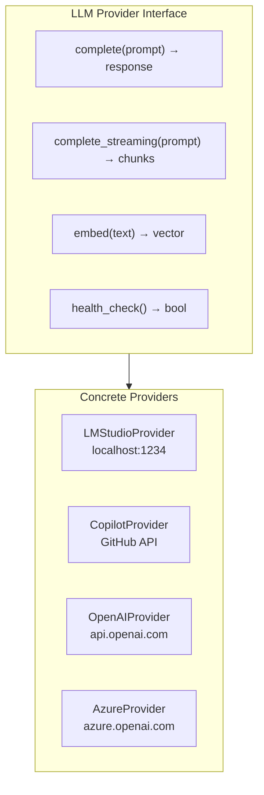
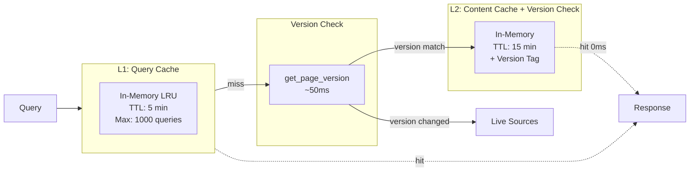
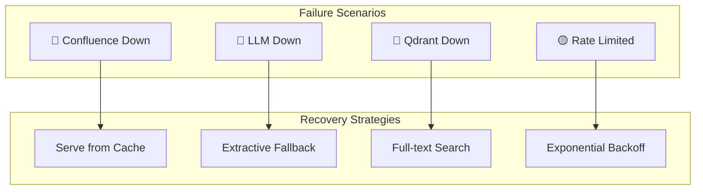
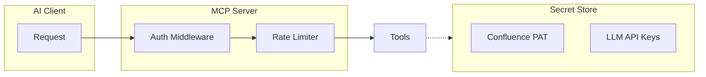

# Confluence MCP - Complete Architecture

**Production-Ready Live RAG System with Skeletal Indexing**

---

## Table of Contents

1. [System Overview](#1-system-overview)
2. [Architecture Layers](#2-architecture-layers)
3. [Data Pipeline](#3-data-pipeline)
4. [MCP Tools](#4-mcp-tools)
5. [LLM Integration](#5-llm-integration)
6. [Caching & Performance](#6-caching--performance)
7. [Resilience & Error Handling](#7-resilience--error-handling)
8. [Observability](#8-observability)
9. [Security](#9-security)
10. [Client Integrations](#10-client-integrations)
11. [Deployment](#11-deployment)

---

## 1. System Overview

### 1.1 Problem Statement

| Pain Point | Impact | Solution |
|------------|--------|----------|
| Finding info takes 10-15 min | Developer productivity loss | Semantic search in seconds |
| Keyword search misses docs | Incomplete answers | Hybrid dense + sparse search |
| Documentation becomes stale | Wrong information | Live fetch from Confluence API |
| No natural language Q&A | High friction | RAG with 3 answer modes |
| Scattered across tools | Context switching | Unified MCP for all clients |

### 1.2 Core Design: Skeletal RAG



| Aspect | Traditional RAG | Skeletal RAG |
|--------|-----------------|--------------|
| Indexed content | Full documents | Titles + extractive summaries |
| Vector DB size | Large (GB) | Small (MB) |
| Content freshness | Stale after indexing | Always current (live fetch) |
| Index speed | Slow (LLM summaries) | Fast (extractive only) |
| Query latency | Fast search, no fetch | Search + live fetch |

### 1.3 Core Capabilities

```
┌─────────────────────────────────────────────────────────────────┐
│                    CORE CAPABILITIES                            │
├─────────────────────────────────────────────────────────────────┤
│  1. SEMANTIC SEARCH                                             │
│     • Hybrid search (dense + sparse vectors)                    │
│     • Typo correction and query understanding                   │
│     • Relevance scoring with importance weighting               │
│                                                                 │
│  2. NATURAL LANGUAGE Q&A                                        │
│     • RAG with 3 modes: AI, Extractive, Hybrid                  │
│     • Grounding validation (no hallucinations)                  │
│     • Citation extraction and validation                        │
│                                                                 │
│  3. ALWAYS FRESH CONTENT                                        │
│     • Live fetch from Confluence API                            │
│     • Includes child pages automatically                        │
│     • HTML → Markdown conversion                                │
│                                                                 │
│  4. MULTI-MODAL SEARCH                                          │
│     • Text: bge-base-en-v1.5 (768-dim)                          │
│     • Images: CLIP-ViT (512-dim)                                │
│     • Code: CodeBERT (768-dim)                                  │
│                                                                 │
│  5. PLUGGABLE LLM                                               │
│     • LM Studio (local dev)                                     │
│     • GitHub Copilot (production)                               │
│     • OpenAI, Anthropic, Azure (alternatives)                   │
└─────────────────────────────────────────────────────────────────┘
```

---

## 2. Architecture Layers

### 2.1 Four-Layer Architecture



### 2.2 Service Layer Detail

```
┌─────────────────────────────────────────────────────────────────┐
│                      SERVICE LAYER                              │
├─────────────────────────────────────────────────────────────────┤
│                                                                 │
│  ┌──────────────┐  ┌──────────────┐  ┌──────────────┐          │
│  │ Search       │  │ Fetch        │  │ RAG          │          │
│  │ Service      │  │ Service      │  │ Service      │          │
│  │              │  │              │  │              │          │
│  │ • Qdrant     │  │ • Confluence │  │ • Context    │          │
│  │ • Reranking  │  │   API        │  │   building   │          │
│  │ • Scoring    │  │ • Parsing    │  │ • Synthesis  │          │
│  └──────────────┘  └──────────────┘  └──────────────┘          │
│                                                                 │
│  ┌──────────────┐  ┌──────────────┐  ┌──────────────┐          │
│  │ Query        │  │ Context      │  │ Grounding    │          │
│  │ Understanding│  │ Builder      │  │ Validator    │          │
│  │              │  │              │  │              │          │
│  │ • Spell      │  │ • Token      │  │ • Score      │          │
│  │   check      │  │   budget     │  │   calculation│          │
│  │ • Intent     │  │ • Ranking    │  │ • Citations  │          │
│  └──────────────┘  └──────────────┘  └──────────────┘          │
│                                                                 │
│  ┌──────────────┐  ┌──────────────┐  ┌──────────────┐          │
│  │ Link         │  │ Cache        │  │ Importance   │          │
│  │ Generator    │  │ Service      │  │ Scorer       │          │
│  └──────────────┘  └──────────────┘  └──────────────┘          │
│                                                                 │
└─────────────────────────────────────────────────────────────────┘
```

---

## 3. Data Pipeline

### 3.1 Pipeline Overview



### 3.2 Phase Details

#### Phase 1: Discovery
```python
# Query Confluence for all pages in space
GET /rest/api/content/search?cql=space=DOCS AND type=page

Output: [page_id, title, version, last_updated]
Speed: ~100 pages/second
```

#### Phase 2: Content Fetch
```python
# Parallel fetch with rate limiting
GET /rest/api/content/{id}?expand=body.storage,metadata,ancestors

Concurrency: 10 parallel requests
Rate limit: 100 requests/minute
Speed: ~10 pages/second
```

#### Phase 3: Content Parsing
```python
# HTML → Markdown + Extract multi-modal content
{
    "markdown": "# Title\n\nContent...",
    "images": [{"url": "...", "alt": "..."}],
    "code_blocks": [{"language": "python", "code": "..."}],
    "tables": [{"headers": [...], "rows": [...]}],
    "headings": ["Overview", "Setup", "Configuration"]
}
Speed: ~100 pages/second
```

#### Phase 4: Analysis + Importance Scoring
```python
# Calculate importance score (0.0 - 3.0)
Signals:
├── Structural (max 1.5)
│   ├── children_count × 0.1 (hub pages)
│   └── incoming_links × 0.05 (reference docs)
├── Hierarchy (max 0.5)
│   └── top-level pages (depth ≤ 2)
├── Labels (max 1.0)
│   └── matches: overview, guide, architecture...
└── Content (max 0.8)
    ├── has_code: +0.3
    ├── has_images: +0.3
    └── word_count > 500: +0.2

Classification:
  HIGH (≥2.0): Hub pages, architecture docs
  MEDIUM (≥1.0): Technical docs
  LOW (<1.0): Meeting notes, simple pages
```

#### Phase 5: Embedding Generation ⚠️ BOTTLENECK
```python
# Text embeddings (required)
Dense: bge-base-en-v1.5 (768-dim) @ 20 pages/sec
Sparse: splade (30k-dim) @ 15 pages/sec

# Image embeddings (optional)
CLIP: clip-vit-base (512-dim) @ 5 images/sec

# Code embeddings (optional)
CodeBERT: codebert-base (768-dim) @ 30 blocks/sec
```

#### Phase 6: Qdrant Storage
```python
# Qdrant payload structure
{
    "page_id": "123456",
    "title": "Kafka Authentication Guide",
    "url": "https://confluence.../pages/123456",
    "space_key": "DOCS",
    "extractive_summary": "Key sentences extracted via TF-IDF...",
    "labels": ["kafka", "security", "guide"],
    "author": "John Doe",
    "breadcrumb": [{"id": "1", "title": "Engineering"}],
    "has_code": true,
    "code_languages": ["java", "properties"],
    "has_images": true,
    "image_count": 2,
    "importance_score": 2.1,
    "importance_signals": {"has_code": true, "label_match": ["guide"]},
    "version": 15,
    "updated_at": "2024-01-15T10:30:00Z"
}
```

### 3.3 Hybrid Summary Storage Strategy

```
┌─────────────────────────────────────────────────────────────────┐
│              HYBRID SUMMARY STORAGE STRATEGY                    │
│           Store Extractive, Generate AI On-Demand               │
├─────────────────────────────────────────────────────────────────┤
│                                                                 │
│  DURING INDEXING:                                               │
│  • Generate extractive summary (TF-IDF) @ 100ms/page            │
│  • Store in Qdrant payload                                      │
│  • NO LLM calls during indexing                                 │
│                                                                 │
│  DURING QUERY:                                                  │
│  ┌─────────────────────────────────────────────────────────────┐│
│  │ MODE 1: EXTRACTIVE (Fast)                                  ││
│  │ • Use pre-stored extractive_summary                        ││
│  │ • No LLM needed                                            ││
│  │ • Time: 100ms                                              ││
│  │ • Quality: ⭐⭐⭐                                           ││
│  └─────────────────────────────────────────────────────────────┘│
│  ┌─────────────────────────────────────────────────────────────┐│
│  │ MODE 2: AI (Best Quality)                                  ││
│  │ • Fetch live content                                       ││
│  │ • Call LLM to generate answer                              ││
│  │ • Time: 3000ms                                             ││
│  │ • Quality: ⭐⭐⭐⭐⭐                                        ││
│  └─────────────────────────────────────────────────────────────┘│
│  ┌─────────────────────────────────────────────────────────────┐│
│  │ MODE 3: HYBRID (Balanced) ⭐ DEFAULT                       ││
│  │ • Use extractive summary as base                           ││
│  │ • LLM refines/improves coherence                           ││
│  │ • Time: 1500ms                                             ││
│  │ • Quality: ⭐⭐⭐⭐                                          ││
│  └─────────────────────────────────────────────────────────────┘│
│                                                                 │
└─────────────────────────────────────────────────────────────────┘
```

### 3.4 Performance Summary

| Scale | CPU Time | GPU Time |
|-------|----------|----------|
| 1,000 pages (text only) | 3-4 min | 2 min |
| 1,000 pages (multi-modal) | 8-10 min | 3-4 min |
| 10,000 pages (text only) | 30-40 min | 15-20 min |
| 10,000 pages (multi-modal) | 80-100 min | 30-40 min |

**Bottleneck:** Embedding generation (Phase 5) - Use GPU for 3-5x speedup

---

## 4. MCP Tools

### 4.1 Tool Overview

| Tool | Description | Latency |
|------|-------------|---------|
| `search_pages` | Semantic search over skeletal index | ~200ms |
| `get_page_with_children` | **Live fetch** page + children | ~1200ms |
| `ask_question` | **Agentic orchestrator** - Full RAG | ~3200ms |
| `get_page_section` | Extract specific section by heading | ~500ms |
| `search_code` | Find pages with code blocks | ~300ms |
| `search_images` | Find pages with diagrams | ~300ms |
| `get_related_pages` | Find linked/similar pages | ~400ms |
| `get_page_tree` | Get page hierarchy | ~200ms |
| `compare_pages` | Diff two pages | ~1500ms |
| `analyze_image` | Describe embedded images | ~2000ms |

### 4.2 Agentic `ask_question` Flow



### 4.3 Grounding Validation

```python
# Phase 6: Grounding Validation
Step 6.1: Calculate Grounding Score
• Compare each answer sentence to source documents
• Use sentence embeddings + cosine similarity
• Threshold: 0.7 similarity = grounded
• Result: 8/9 sentences grounded = 0.89 score

Step 6.2: Validate Citations
• Extract citations: [Source: ...]
• Match against actual source titles
• Result: 3/3 citations valid

Step 6.3: Calculate Confidence
• Grounding score: 0.89 (50% weight)
• Citation count: 3 (25% weight)
• Search scores: 0.92, 0.88, 0.85 (25% weight)
• Final confidence: 0.88 (88%)

Quality Metrics:
• Confidence: 88% ✅ (threshold: 70%)
• Grounding: 89% ✅
• Is Grounded: Yes ✅
```

---

## 5. LLM Integration

### 5.1 Abstraction Layer



### 5.2 Provider Configuration

```python
# config/llm_providers.yaml
providers:
  lm_studio:
    type: openai_compatible
    base_url: http://localhost:1234/v1
    model: local-model
    use_for: [development, testing]
    
  github_copilot:
    type: copilot
    api_key: ${GITHUB_TOKEN}
    use_for: [production]
    
  openai:
    type: openai
    api_key: ${OPENAI_API_KEY}
    model: gpt-4o-mini
    use_for: [fallback]

# Auto-select based on environment
default_provider: ${LLM_PROVIDER:-lm_studio}
```

### 5.3 Summary Mode Selection

| Mode | When to Use | Speed | Quality |
|------|-------------|-------|---------|
| **Extractive** | Quick lookups, simple queries | ⚡ 100ms | ⭐⭐⭐ |
| **AI** | Complex questions, best quality | 🐢 3000ms | ⭐⭐⭐⭐⭐ |
| **Hybrid** | Default - balanced | ⚖️ 1500ms | ⭐⭐⭐⭐ |

---

## 6. Caching & Performance

### 6.1 Multi-Layer Cache (Stage 2 — Smart Version-Check)



### 6.2 Performance Breakdown

```
┌──────────────────────────────────────────────────────────────┐
│ ask_question PERFORMANCE (Total: ~3s)                         │
├──────────────────────────────────────────────────────────────┘
│ Phase 1: Query Understanding        20ms    (0.6%)           │
│ Phase 2: Semantic Search           200ms    (6.3%)           │
│ Phase 3: Version Check              50ms    (1.6%)  Stage 2  │
│ Phase 3: Content Fetch             0-500ms  (var.)  ⚠️        │
│ Phase 4: Section Scoring            20ms    (0.6%)  Stage 2  │
│ Phase 5: Answer Generation        1550ms   (48.4%)  ⚠️        │
│ Phase 6: Grounding Validation      100ms    (3.1%)           │
│ Phase 7: Response Formatting        50ms    (1.6%)           │
└──────────────────────────────────────────────────────────────┘

STAGE 2 OPTIMIZATION:
• Content Fetch: 0ms on cache hit (version match) vs 500ms cache miss
• Section Scoring: Only top 3 sections injected, not blind truncation
```

---

## 7. Resilience & Error Handling

### 7.1 Failure Modes



### 7.2 Circuit Breaker

```python
class CircuitBreaker:
    states: CLOSED → OPEN → HALF_OPEN → CLOSED
    
    CLOSED:    Normal operation
    OPEN:      Service failing, use fallback (5 failures in 1 min)
    HALF_OPEN: Test with single request after 30s cooldown
    
# Per-service breakers
confluence_breaker = CircuitBreaker(failure_threshold=5, timeout=30)
llm_breaker = CircuitBreaker(failure_threshold=3, timeout=60)
qdrant_breaker = CircuitBreaker(failure_threshold=3, timeout=30)
```

---

## 8. Observability

### 8.1 Metrics (Prometheus)

```python
# Key metrics
mcp_requests_total{tool="ask_question", status="success"}
mcp_request_duration_seconds{tool="search_pages", quantile="0.95"}
cache_hits_total{layer="content"}
confluence_api_calls_total{endpoint="content"}
llm_tokens_used_total{operation="synthesis"}
grounding_score{range="high|medium|low"}
```

### 8.2 Structured Logging

```json
{
    "timestamp": "2024-01-15T10:30:00Z",
    "level": "INFO",
    "service": "mcp_server",
    "tool": "ask_question",
    "request_id": "abc-123",
    "query": "How does Kafka auth work?",
    "pages_searched": 5,
    "pages_fetched": 3,
    "summary_mode": "hybrid",
    "grounding_score": 0.89,
    "confidence": 0.88,
    "latency_ms": 3200
}
```

### 8.3 Health Endpoints

```
GET /health          → Basic health check
GET /health/ready    → Ready to serve (all dependencies up)
GET /health/live     → Process alive
GET /metrics         → Prometheus metrics
```

---

## 9. Security

### 9.1 Authentication



### 9.2 Security Measures

| Layer | Protection |
|-------|------------|
| Transport | HTTPS for SSE, secure STDIO |
| Confluence PAT | Stored in env vars, never logged |
| Rate Limiting | Per-client request limits |
| Input Validation | Sanitize all user queries |
| Page Permissions | Respect Confluence ACLs |

---

## 10. Client Integrations

### 10.1 Microsoft Teams

```
┌─────────────────────────────────────────────────────────────────┐
│ 🤖 Confluence Assistant                                         │
├─────────────────────────────────────────────────────────────────┤
│                                                                 │
│ To configure Kafka replication:                                 │
│                                                                 │
│ 1. Set replication factor:                                      │
│    kafka-topics.sh --create --replication-factor 3             │
│    [Source: Kafka Replication Guide]                           │
│                                                                 │
│ 2. Configure min.insync.replicas:                               │
│    min.insync.replicas=2                                       │
│    [Source: Kafka Configuration Reference]                     │
│                                                                 │
│ ───────────────────────────────────────────────────────────────│
│ 📚 Sources:                                                     │
│ • Kafka Replication Guide [View] [Edit]                        │
│ • Kafka Configuration Reference [View] [Edit]                  │
│                                                                 │
│ ✅ Confidence: 88% | 📊 Grounding: 89% | 📝 Citations: 3       │
└─────────────────────────────────────────────────────────────────┘
```

### 10.2 Client Configurations

#### Claude Desktop
```json
{
  "mcpServers": {
    "confluence": {
      "command": "python",
      "args": ["-m", "mcp_server.server"],
      "cwd": "C:/path/to/enterprise_confluence_ai"
    }
  }
}
```

#### LM Studio
```json
{
  "mcp": {
    "servers": [{
      "name": "confluence",
      "transport": "sse",
      "url": "http://localhost:8080/sse"
    }]
  }
}
```

#### GitHub Copilot
```json
{
  "mcp": {
    "servers": {
      "confluence": {
        "command": "python",
        "args": ["-m", "mcp_server.server", "--transport", "stdio"]
      }
    }
  }
}
```

---

## 11. Deployment

### 11.1 File Structure

```
mcp_server/
├── __init__.py
├── server.py                    # FastMCP + transports
├── config.py                    # Settings
│
├── pipeline/                    # Data Pipeline
│   ├── discovery.py
│   ├── fetcher.py
│   ├── parser.py
│   ├── analyzer.py
│   ├── importance_scorer.py
│   ├── summarizer.py            # Map-Reduce summarization (Stage 2)
│   ├── background_worker.py     # Progressive LLM summary worker (Stage 2)
│   ├── embedder.py
│   ├── indexer.py
│   └── run_pipeline.py
│
├── tools/                       # 10 MCP Tools
│   ├── search_pages.py
│   ├── get_page.py
│   ├── ask_question.py
│   ├── search_content.py
│   ├── navigation.py
│   └── compare.py
│
├── services/                    # Business Logic
│   ├── search_service.py
│   ├── fetch_service.py
│   ├── rag_service.py
│   ├── query_understanding.py
│   ├── context_builder.py
│   ├── grounding_validator.py
│   └── cache_service.py
│
├── llm/                         # LLM Abstraction
│   ├── base_provider.py
│   ├── lm_studio_provider.py
│   ├── copilot_provider.py
│   └── openai_provider.py
│
└── models/                      # Pydantic Schemas
    ├── page.py
    └── responses.py
```

### 11.2 Quick Start

```bash
# 1. Run data pipeline (one-time)
python -m mcp_server.pipeline.run_pipeline --full

# 2. Start MCP server (SSE for LM Studio)
python -m mcp_server.server --transport sse --port 8080

# 3. Start MCP server (STDIO for Claude Desktop)
python -m mcp_server.server --transport stdio

# 4. Run incremental sync (hourly cron)
python -m mcp_server.pipeline.run_pipeline --incremental

# 5. Health check
curl http://localhost:8080/health
```

---

## Key Points to Remember

1. **Skeletal Index**: Store only titles + extractive summaries, fetch live content
2. **3 Summary Modes**: Extractive (fast), AI (best), Hybrid (balanced)
3. **Map-Reduce Summarization (Stage 2)**: Full document understanding via chunked parallel summarization
4. **Smart Version-Check Caching (Stage 2)**: 0ms cache hits when page unchanged
5. **Section-Level RAG Context (Stage 2)**: Top 3 sections by relevance, not blind truncation
6. **Importance Scoring**: 0-3.0 score to prioritize high-value pages
7. **Grounding Validation**: Prevent hallucinations with citation checking
8. **Pluggable LLM**: Easy swap between LM Studio, Copilot, OpenAI
9. **Multi-Layer Cache**: Query → Content (versioned) → Embedding caches
10. **Circuit Breakers**: Graceful degradation when services fail
11. **Always Fresh**: Live fetch from Confluence = never stale
