# Live RAG MCP Server Architecture

A production-ready MCP (Model Context Protocol) server for Confluence that uses **skeletal indexing** + **live content fetching** for real-time, accurate responses.

---

## System Overview

```mermaid
graph TB
    subgraph Clients["🖥️ AI Clients"]
        CD["Claude Desktop"]
        GH["GitHub Copilot"]
        LM["LM Studio"]
    end

    subgraph MCP["🔧 MCP Server"]
        TR["Transport<br/>(SSE/STDIO)"]
        TL["10 Tools"]
        SV["Services"]
    end

    subgraph Index["📊 Skeletal Index"]
        QD[("Qdrant<br/>Titles + Summaries")]
    end

    subgraph Live["🌐 Live Sources"]
        CF["Confluence API"]
        LLM["LM Studio API"]
    end

    Clients --> TR --> TL --> SV
    SV --> QD
    SV --> CF
    SV --> LLM
```



---

## Core Concept: Skeletal RAG

| Traditional RAG | Skeletal RAG (This System) |
|-----------------|---------------------------|
| Index **full content** in vectors | Index only **titles + summaries** |
| Stale data after indexing | **Live fetch** = always current |
| Large vector DB | Tiny vector DB |
| Fast queries, slow updates | Fast updates, smart queries |

---

## Part 1: Data Pipeline

### Pipeline Flow

```mermaid
flowchart LR
    subgraph S1["Stage 1"]
        D["🔍 Discovery<br/>Confluence API"]
    end
    subgraph S2["Stage 2"]
        A["📝 Analyzer<br/>Content Detection"]
    end
    subgraph S25["Stage 2.5"]
        I["⭐ Importance<br/>Scoring"]
    end
    subgraph S3["Stage 3"]
        SUM["🤖 Summarizer<br/>LLM Generation"]
    end
    subgraph S4["Stage 4"]
        E["🧮 Embedder<br/>Dense + Sparse"]
    end
    subgraph S5["Stage 5"]
        ST["💾 Storage<br/>Qdrant"]
    end

    D --> A --> I --> SUM --> E --> ST
```



### Stage Details

#### Stage 1: Discovery
```
Confluence REST API → page_id, title, url, labels, author, breadcrumb, content_html
Speed: ~10 pages/sec
```

#### Stage 2: Content Analyzer
```python
# Detects content structure WITHOUT storing full content
{
    "has_code": True,
    "code_languages": ["python", "bash"],
    "has_images": True,
    "image_count": 3,
    "has_tables": True,
    "heading_structure": ["Introduction", "Setup", "Configuration"],
    "word_count": 1250,
    "internal_links": 5
}
```

#### Stage 2.5: Importance Scoring

```python
Score Range: 0.0 - 3.0

Signals:
├── Structural (max 1.5)
│   ├── children_count × 0.1 (hub pages)
│   └── incoming_links × 0.05 (reference docs)
├── Hierarchy (max 0.5)
│   └── top-level pages (depth ≤ 2)
├── Labels (max 1.0)
│   └── matches: overview, guide, architecture, tutorial...
└── Content (max 0.8)
    ├── has_code: +0.3
    ├── has_images: +0.3
    └── word_count > 500: +0.2

Classification:
  HIGH (≥2.0): Hub pages, architecture docs
  MEDIUM (≥1.0): Technical docs
  LOW (<1.0): Meeting notes, simple pages
```

#### Stage 3: Summarizer (Map-Reduce)
```
Stage 2 Enhancement: Map-Reduce for long documents

Phase 1 (inline, fast):  Extractive summary via TF-IDF (~100 pages/sec)
Phase 2 (background):   Map-Reduce LLM summary (~2 pages/sec)

Map-Reduce Flow:
  1. Condense huge tables (50 rows → 10 + count)
  2. Chunk text into 3500-char overlapping pieces
  3. MAP: Parallel LLM summary for each chunk
  4. REDUCE: Synthesize master summary
  → Result: Understands the END of long documents!

Background Worker: Runs after initial indexing
  Finds pages without LLM summary → Map-Reduce → Re-embed → Update
  Quality improves progressively over time
```

#### Stage 4: Embedding
```
Input: title + summary (combined)
Models:
  - Dense: bge-small-en-v1.5 (384-dim)
  - Sparse: SPLADE (for keyword matching)
Speed: ~50 pages/sec (batched)
```

#### Stage 5: Qdrant Storage
```python
# Collection: confluence_skeletal
# Vectors: dense + sparse (hybrid search)
# Payload:
{
    "page_id": "123456",
    "title": "Kafka Authentication Guide",
    "summary": "Explains how to configure SASL authentication for Kafka clusters...",
    "url": "https://confluence.example.com/pages/123456",
    "labels": ["kafka", "security", "guide"],
    "author": "John Doe",
    "breadcrumb": [{"id": "1", "title": "Engineering"}, {"id": "2", "title": "Kafka"}],
    "has_code": True,
    "code_languages": ["java", "properties"],
    "has_images": True,
    "image_count": 2,
    "has_tables": False,
    "heading_structure": ["Overview", "SASL Setup", "Testing"],
    "word_count": 1500,
    "children_count": 3,
    "parent_id": "2",
    "importance_score": 2.1,
    "importance_signals": {"has_code": True, "label_match": ["guide"]},
    "updated_at": "2024-01-15T10:30:00Z"
}
```

---

## Part 2: MCP Server

### Architecture Layers

```mermaid
graph TB
    subgraph Transport["Transport Layer"]
        SSE["SSE Server<br/>(LM Studio)"]
        STDIO["STDIO Server<br/>(Copilot)"]
    end

    subgraph Protocol["Protocol Layer"]
        PH["MCP Handler"]
        TR["Tool Router"]
    end

    subgraph Tools["Tool Layer (10 Tools)"]
        T1["search_pages"]
        T2["get_page_with_children"]
        T3["ask_question ⚡"]
        T4["get_page_section"]
        T5["search_code"]
        T6["search_images"]
        T7["get_related_pages"]
        T8["get_page_tree"]
        T9["compare_pages"]
        T10["analyze_image"]
    end

    subgraph Services["Service Layer"]
        SS["SearchService"]
        FS["FetchService"]
        SY["SynthesisService"]
        CB["ContextBuilder"]
        QU["QueryUnderstanding"]
    end

    subgraph Data["Data Layer"]
        QD[("Qdrant")]
        CF["Confluence API"]
        LLM["LM Studio"]
    end

    Transport --> Protocol --> Tools --> Services --> Data
```



### The 10 Core Tools

| Tool | Description | Returns |
|------|-------------|---------|
| `search_pages` | Semantic search over skeletal index | List of page summaries |
| `get_page_with_children` | **Live fetch** page + children | Full markdown content |
| `get_page_section` | Extract specific section by heading | Section content |
| `search_code` | Find pages with code blocks | Pages with code snippets |
| `search_images` | Find pages with diagrams | Pages with image descriptions |
| `get_related_pages` | Find linked/similar pages | Related page list |
| `get_page_tree` | Get page hierarchy | Tree structure |
| `compare_pages` | Diff two pages | Comparison table |
| `analyze_image` | Describe embedded images | Image descriptions |
| **`ask_question`** | **Agentic orchestrator** | Synthesized answer |

### Agentic `ask_question` Flow

The `ask_question` tool **orchestrates other tools** to build comprehensive answers:


### Streaming Response Format

All tools return **streaming JSON** for real-time UI updates:

```json
{"type": "search_started", "query": "kafka authentication"}
{"type": "search_result", "pages": [{"title": "...", "score": 0.92}]}
{"type": "fetching_content", "page_ids": ["123", "456"]}
{"type": "context_built", "token_count": 4500, "sources": 3}
{"type": "synthesis_started"}
{"type": "answer_chunk", "text": "Kafka authentication uses "}
{"type": "answer_chunk", "text": "SASL mechanisms including..."}
{"type": "validation", "grounding_score": 0.91, "citations_valid": true}
{"type": "complete", "confidence": 0.88}
```

---

## Part 3: Content Processing

### HTML → Markdown Conversion

All Confluence content is converted to **clean Markdown** before LLM processing:

```python
# Input: Confluence HTML
<h1>Setup Guide</h1>
<p>Follow these steps:</p>
<ac:structured-macro ac:name="code">
  <ac:parameter ac:name="language">bash</ac:parameter>
  <ac:plain-text-body>pip install kafka-python</ac:plain-text-body>
</ac:structured-macro>

# Output: Clean Markdown
# Setup Guide

Follow these steps:

```bash
pip install kafka-python
```
```

### Handled Content Types

| Confluence Element | Markdown Output |
|-------------------|-----------------|
| Headers (h1-h6) | `# Header` |
| Paragraphs | Plain text |
| Code blocks | ` ```language\ncode\n``` ` |
| Tables | Markdown tables |
| Images | `` + description |
| Links | `[text](url)` |
| Lists | `- item` or `1. item` |
| Macros | Extracted content |

---

## Performance Characteristics

### Pipeline Performance
| Stage | Speed | Bottleneck |
|-------|-------|------------|
| Discovery | ~10 pages/sec | API rate limit |
| Analyzer | ~100 pages/sec | CPU |
| Importance | ~500 pages/sec | CPU |
| Extractive Summary | ~100 pages/sec | CPU |
| Map-Reduce Summary | **~2 pages/sec** | **LLM (background)** |
| Embedder | ~50 pages/sec | GPU/CPU |
| Storage | ~100 pages/sec | I/O |

**Initial indexing: ~4 min** (extractive only, no LLM blocking)
**Background upgrade: ~10 min** (Map-Reduce LLM summaries)

### Query Performance
| Operation | Latency |
|-----------|---------|
| Skeletal search | ~50ms |
| Version check (Stage 2) | ~50ms |
| Live page fetch (cache miss) | ~200-500ms |
| Live page fetch (cache hit) | **~0ms** |
| Section scoring (Stage 2) | ~20ms |
| LLM synthesis | ~2-5s (streaming) |
| **Total ask_question** | **~3-6s** (streaming) |

---

## File Structure

```
mcp_server/
├── __init__.py
├── server.py                    # FastMCP + transports
├── config.py                    # Settings
│
├── pipeline/                    # Data Pipeline
│   ├── __init__.py
│   ├── discovery.py             # Confluence crawler
│   ├── analyzer.py              # Content detection
│   ├── importance_scorer.py     # Importance calculation
│   ├── summarizer.py            # Map-Reduce summarization (Stage 2)
│   ├── background_worker.py     # Progressive LLM summary worker (Stage 2)
│   ├── indexer.py               # Qdrant storage
│   └── run_pipeline.py          # CLI entry point
│
├── tools/                       # 10 MCP Tools
│   ├── __init__.py
│   ├── search_pages.py
│   ├── get_page.py              # get_page_with_children, get_page_section
│   ├── ask_question.py          # Agentic orchestrator
│   ├── search_content.py        # search_images, search_code
│   ├── navigation.py            # get_related_pages, get_page_tree
│   └── compare.py               # compare_pages, analyze_image
│
├── services/                    # Business Logic
│   ├── __init__.py
│   ├── search_service.py        # Qdrant operations
│   ├── fetch_service.py         # Live Confluence fetcher
│   ├── synthesis_service.py     # LLM integration
│   ├── query_understanding.py   # Intent detection
│   └── context_builder.py       # Token budgeting
│
└── models/                      # Pydantic Schemas
    ├── __init__.py
    ├── page.py
    └── responses.py
```

---

## Client Configurations

### Claude Desktop
```json
{
  "mcpServers": {
    "confluence": {
      "command": "python",
      "args": ["-m", "mcp_server.server"],
      "cwd": "C:/path/to/enterprise_confluence_ai"
    }
  }
}
```

### LM Studio
```json
{
  "mcp": {
    "servers": [
      {
        "name": "confluence",
        "transport": "sse",
        "url": "http://localhost:8080/sse"
      }
    ]
  }
}
```

---

## Part 4: Caching Architecture (Stage 2 — Smart Version-Check)

### Multi-Layer Cache Strategy


### Cache Configuration

| Cache Layer | Storage | TTL | Max Size | Use Case |
|------------|---------|-----|----------|----------|
| **Query Cache** | In-memory (LRU) | 5 min | 1000 queries | Repeated questions |
| **Content Cache** | In-memory + version | 15 min | 500 pages | Live-fetched pages |
| **Embedding Cache** | In-memory | 30 min | 500 queries | Query embeddings |
| **Summary Cache** | Qdrant payload | Permanent | N/A | Pre-generated summaries |

### Smart Cache Invalidation (Stage 2)

```python
# Stage 2 Version-Check Flow:
1. get_page_version(page_id)          # ~50ms lightweight API call
2. cache.get_versioned(key, version)  # Check if version matches cached
3. If match → return cached (0ms!)    # No full API call needed
4. If mismatch → full fetch → cache.set_versioned(key, data, version)

# Other invalidation triggers:
5. TTL expiry: Automatic (15 min for content)
6. Full refresh: cache.clear() (pipeline re-run)
```

---

## Part 5: Resilience & Error Handling

### Failure Modes & Recovery

```mermaid
graph TB
    subgraph Failures["Failure Scenarios"]
        F1["🔴 Confluence Down"]
        F2["🔴 LM Studio Down"]
        F3["🔴 Qdrant Down"]
        F4["🟡 Rate Limited"]
        F5["🟡 Timeout"]
    end

    subgraph Recovery["Recovery Strategies"]
        R1["Serve from Cache"]
        R2["Extractive Fallback"]
        R3["Graceful Degradation"]
        R4["Exponential Backoff"]
        R5["Retry with Timeout"]
    end

    F1 --> R1
    F2 --> R2
    F3 --> R3
    F4 --> R4
    F5 --> R5
```



### Fallback Strategies

| Failure | Impact | Fallback |
|---------|--------|----------|
| **Confluence API down** | Cannot fetch live content | Serve cached content + warning |
| **LM Studio down** | Cannot synthesize answers | Return raw sources + extractive summary |
| **Qdrant down** | Cannot search | Full-text search via Confluence API |
| **Rate limited** | Slow responses | Queue requests + exponential backoff |

### Circuit Breaker Pattern

```python
class CircuitBreaker:
    states: CLOSED → OPEN → HALF_OPEN → CLOSED
    
    CLOSED:    Normal operation
    OPEN:      Service failing, use fallback (5 failures in 1 min)
    HALF_OPEN: Test with single request after 30s cooldown
    
    # Per-service breakers
    confluence_breaker = CircuitBreaker(failure_threshold=5, timeout=30)
    llm_breaker = CircuitBreaker(failure_threshold=3, timeout=60)
```

---

## Part 6: Incremental Sync

### Keeping the Index Fresh


### Sync Modes

| Mode | Trigger | Scope | Speed |
|------|---------|-------|-------|
| **Full Sync** | Manual / First run | All pages | ~2 pages/sec |
| **Incremental** | Scheduled (hourly) | Modified pages only | Fast |
| **On-Demand** | Page access | Single page | Instant |
| **Webhook** | Confluence event | Real-time | Instant |

### Version Tracking

```python
# Stored in Qdrant payload:
{
    "page_id": "123",
    "version": 15,           # Confluence version number
    "indexed_at": "...",     # When we last processed
    "content_hash": "abc..."  # Hash of content for change detection
}

# On fetch: compare version, re-index if changed
```

---

## Part 7: Multi-Space Support

### Space-Aware Architecture

```python
# Qdrant payload includes space context:
{
    "page_id": "123",
    "space_key": "ENGINEERING",
    "space_name": "Engineering Documentation",
    ...
}

# Search can be scoped:
search_pages(
    query="kafka setup",
    space_filter=["ENGINEERING", "DEVOPS"],  # Optional
    limit=10
)
```

### Cross-Space Search


---

## Part 8: Observability

### Metrics (Prometheus-compatible)

```python
# Key metrics to track:
mcp_requests_total{tool="ask_question", status="success"}
mcp_request_duration_seconds{tool="search_pages", quantile="0.95"}
cache_hits_total{layer="content"}
cache_misses_total{layer="content"}
confluence_api_calls_total{endpoint="content"}
llm_tokens_used_total{operation="synthesis"}
llm_latency_seconds{quantile="0.95"}
index_pages_total{space="ENGINEERING"}
```

### Structured Logging

```json
{
    "timestamp": "2024-01-15T10:30:00Z",
    "level": "INFO",
    "service": "mcp_server",
    "tool": "ask_question",
    "request_id": "abc-123",
    "user_query": "How does Kafka auth work?",
    "pages_searched": 5,
    "pages_fetched": 3,
    "cache_hit": true,
    "latency_ms": 2500,
    "tokens_used": 1200
}
```

### Health Endpoints

```
GET /health          → Basic health check
GET /health/ready    → Ready to serve (all dependencies up)
GET /health/live     → Process alive
GET /metrics         → Prometheus metrics
```

---

## Part 9: Security

### Authentication & Authorization


### Security Measures

| Layer | Protection |
|-------|------------|
| **Transport** | HTTPS for SSE, secure STDIO |
| **Confluence PAT** | Stored in env vars, never logged |
| **Rate Limiting** | Per-client request limits |
| **Input Validation** | Sanitize all user queries |
| **Page Permissions** | Respect Confluence ACLs (if available) |

### Secrets Management

```python
# .env (never commit!)
CONFLUENCE_PAT=xxx
LM_STUDIO_API_KEY=xxx  # If applicable

# In code:
from config import settings
# PAT loaded from env, never hardcoded
```

---

## Quick Start Commands

```bash
# 1. Run the data pipeline (one-time setup)
python -m mcp_server.pipeline.run_pipeline --full

# 2. Start MCP server (SSE mode for LM Studio)
python -m mcp_server.server --transport sse --port 8080

# 3. Start MCP server (STDIO mode for Claude Desktop)
python -m mcp_server.server --transport stdio

# 4. Run incremental sync
python -m mcp_server.pipeline.run_pipeline --incremental

# 5. Health check
curl http://localhost:8080/health
```

---

## Troubleshooting

| Issue | Solution |
|-------|----------|
| LLM summaries too slow | Increase batch size, use faster model |
| Confluence rate limited | Increase delay, use caching aggressively |
| Qdrant out of memory | Use disk storage, reduce payload size |
| Stale search results | Run incremental sync, reduce cache TTL |
| Missing page content | Check Confluence permissions, verify PAT |

